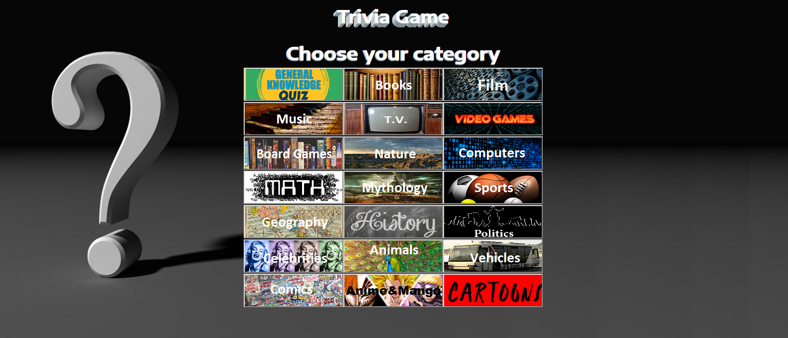
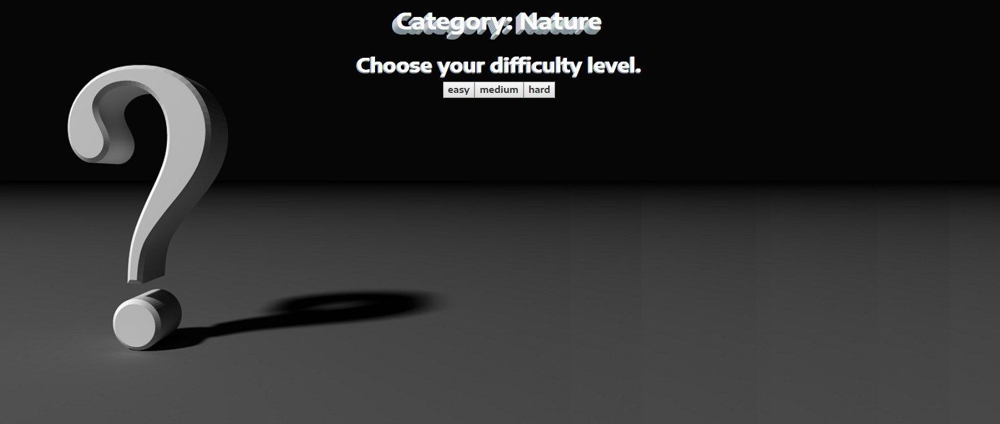
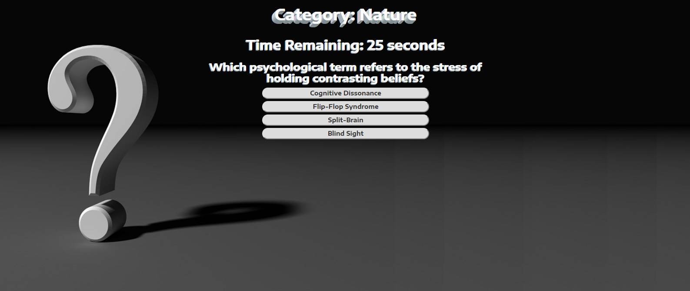
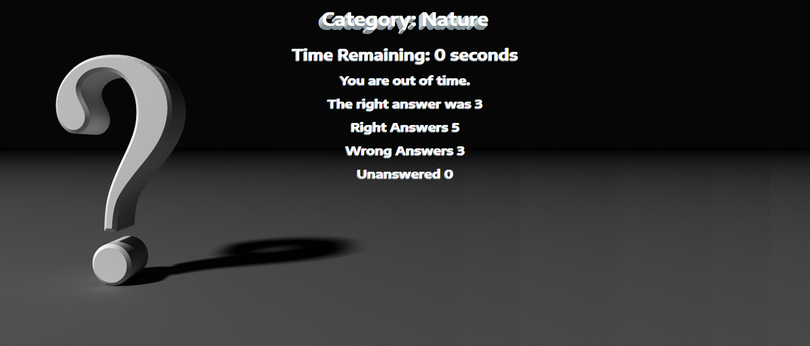
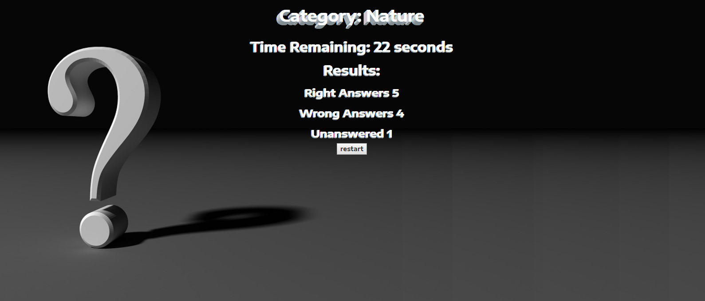

# trivia-game
A multi category trivia game, using an api for trivia questions.  User may select category  
 
 
and difficulty level  
 
 
The user then gets 30 seconds to answer each question  
 
 
Once the answer is selected the screen shows a tally of correct and incorrect answers.  
 
 
If the user runs out of time the results appear before moving to the next question.
 
 
Finally after ten questions, the user is taken to the results page.  
 
 